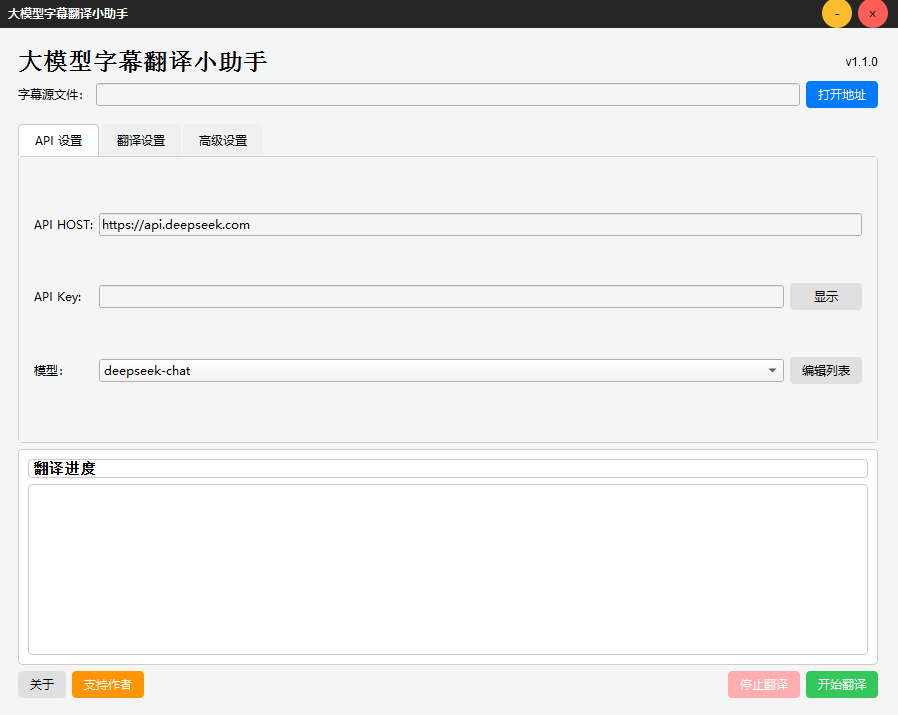
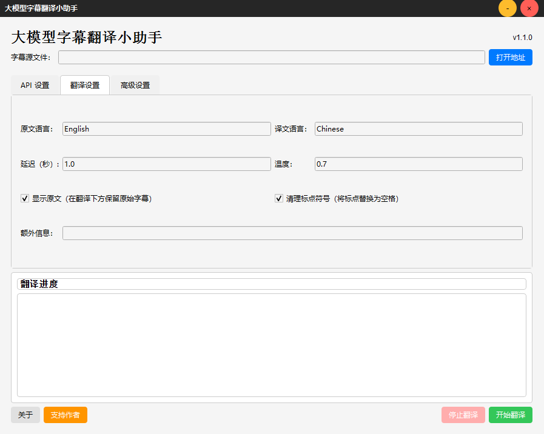

## 为什么选择大模型字幕翻译小助手？

### 相比传统翻译工具的优势

1. **类人翻译质量**:
   - 大语言模型比传统翻译引擎更能理解上下文、俚语和文化背景
   - 保留对话的原始语气、幽默和情感上的细微差别

2. **智能上下文处理**:
   - 理解完整叙事，而不是逐行孤立翻译
   - 在整个过程中保持术语、人物引用和故事元素的一致性

3. **智能文本格式化**:
   - 自动清理听障元素（背景声音等）
   - 智能调整换行和句子结构以优化视觉效果
   - 删除多余标点以获得更清晰的视觉效果

4. **稳健的运行机制**:
   - 优雅地处理网络问题和API故障
   - 持续保存进度以防止工作丢失

## 工作原理

### 智能上下文处理

应用程序使用复杂的方法来维护整个字幕文件的上下文：

1. **带上下文重叠的批处理**:
   - 字幕以可自定义大小的批次送入大模型处理（默认：每批30行）
   - 每个批次包括目标部分前后5行的上下文
   - 例如，要翻译第1-30行，应用程序将第1-35行提供给大模型，但只保留第1-30行的结果

2. **智能文本处理**:
   - 自动删除听障元素（背景声音、音乐描述）
   - 智能调整句子顺序和换行以实现自然阅读
   - 用空格替换标点以获得更清洁的视觉呈现
   - 在适当的情况下将多行合并为单个连贯的行
   - 自动删除可能因API响应问题而出现的重复行

3. **容错机制**:
   - 保留无法翻译的行的原始文本
   - 实施自动重试
   - 持续保存进度以防止工作丢失

<div align="center">
  
  
  <p>
    <strong>具有上下文感知的AI字幕翻译软件</strong>
  </p>
  
  <p>
    <a href="#功能">功能</a> •
    <a href="#安装">安装</a> •
    <a href="#使用">使用</a> •
    <a href="#配置">配置</a> •
    <a href="#构建自己的可执行文件">构建</a> •
    <a href="#许可证">许可证</a>
  </p>
</div>

## 介绍

大模型字幕翻译小助手是一款开源桌面应用程序，利用大语言模型翻译字幕文件，具有卓越的上下文感知能力。与Google翻译、DeepL或百度翻译等传统翻译服务不同，该工具利用AI语言模型生成听起来自然、类人的翻译。

应用程序整体处理字幕，理解对话和叙事的全部上下文。这样可以得到保留细微差别、文化引用并在整个内容中保持一致语气的翻译 - 传统翻译工具往往难以做到这一点。

通过使用具有上下文重叠的复杂批处理系统，小助手确保各节之间的无缝过渡，同时优化内存使用和API效率。

<div align="center">
  
</div>

## 功能

- **LLM驱动的翻译**：使用大语言模型替代传统翻译API（Google翻译、DeepL等），以更自然、更准确的人类口语实现翻译
- **上下文感知处理**：作为一个整体处理字幕文件，考虑全局上下文以保持叙事连贯性
- **高级批处理**：以可配置的批次翻译字幕，同时包括每个批次前后5行的上下文，以确保各节之间的无缝过渡
- **听障字幕删除**：自动删除背景声音描述和其他听障元素
- **智能文本格式化**:
  - 自动调整句子顺序和换行以提高可读性
  - 用空格替换标点以获得更清洁的视觉效果
  - 在适当的情况下将多行合并为单行
  - 删除可能因网络问题导致的重复行
- **备用保留**：保留无法翻译的行的原始文本，最大限度地减少观看中断
- **可自定义翻译参数**：调整温度、批次大小和其他设置以优化结果
- **多LLM支持**：兼容各种AI模型，包括DeepSeek、Qwen、Moonshot、GPT等
- **简洁UI**：现代PyQt6界面，操作直观
- **格式保留**：保持字幕时间和格式
- **原始文本保留**：可选择保留原始文本
- **强大的错误处理**：通过自动重试从API错误中优雅地恢复

## 安装

### 先决条件

- Python 3.7 或更高版本
- 用于API访问的互联网连接

### 方法1：从源代码构建

1. 克隆仓库:
   ```bash
   git clone https://github.com/chwbob/LLM_subtitle_translator.git
   cd LLM_subtitle_translator
   ```

2. 安装依赖:
   ```bash
   pip install -r requirements.txt
   ```

3. 运行应用程序:
   ```bash
   python subtitle_translator.py
   ```

### 方法2：使用预构建的可执行文件（推荐）

1. 从[发布](https://github.com/chwbob/LLM-subtitle-translator/releases/tag/V1.1.3)页面下载最新版本
2. - 对于Windows用户，运行 `LLM_SubtitleTranslator.exe`
   - 对于x86 CPU的Macos用户，运行 `LLM_SubtitleTranslator_X86.dmg`
   - 对于ARM CPU的Macos用户，运行 `LLM_SubtitleTranslator_ARM64.dmg`

## 使用

<div align="center">
  
</div>

### 基本翻译流程

1. **配置API设置**:
   - 输入您的API主机（例如 `https://api.deepseek.com`）
   - 添加您的API密钥
   - 选择要使用的AI模型

2. **选择源文件**:
   - 点击"打开地址"选择SRT字幕文件

3. **配置翻译设置**:
   - 设置源语言和目标语言
   - 根据需要调整翻译参数
   - 可选择调整批次大小和其他高级设置

4. **开始翻译**:
   - 点击"开始翻译"
   - 选择保存翻译文件的位置
   - 在日志窗口中监控进度

5. **查看结果**:
   - 在您喜欢的播放器或编辑器中打开翻译后的SRT文件
   - 享受自然语言、正确格式和一致上下文的字幕

### 翻译设置

<div align="center">
  
</div>

应用程序提供多个自定义选项:

- **源/译文语言**：定义原始语言和目标语言
- **延迟**：API请求之间的时间（秒）
- **温度**：控制翻译的创造性（0.0-1.0）
- **显示原文**：在翻译下方保留原始文本，可获得双语字幕
- **清理标点符号**：用空格替换标点以获得更清洁的外观
- **额外信息**：提供额外信息以获得更好的翻译（例如："这是一部科幻电影"）

## 配置

### API设置

<div align="center">
  
</div>

应用程序支持各种LLM提供商。添加或修改可用模型：

1. 在API设置选项卡中点击"编辑列表"
2. 添加新模型或选中/取消选中现有模型
3. 点击"保存"更新您的更改

### 高级设置

<div align="center">
  
</div>

针对高级用户：

- **批次大小**：每个API请求处理的字幕数（默认：30）
- **自定义系统提示**：修改系统提示模板以满足特定翻译需求

## 构建自己的可执行文件

仓库按不同操作系统组织了单独的构建配置：

```
LLM_subtitle_translator/
├── for_windows/
│   ├── build.py                # 使用PyInstaller的Windows构建脚本
│   ├── assets/
│   │   ├── icon.ico            # Windows应用程序图标
│   │   └── AAA.jpg             # 捐赠二维码图像
│   └── ...
├── for_mac/
│   ├── build.py                # 使用py2app的macOS构建脚本
│   ├── build-macos.yml         # macOS的GitHub Actions工作流
│   ├── assets/
│   │   ├── icon.icns           # macOS应用程序图标
│   │   └── AAA.jpg             # 捐赠二维码图像
│   └── ...
└── ...
```

### 为Windows构建

1. 导航到Windows目录：
   ```bash
   cd for_windows
   ```

2. 安装PyInstaller：
   ```bash
   pip install pyinstaller
   ```

3. 运行构建脚本：
   ```bash
   python build.py
   ```

这将在`dist`目录中创建一个独立的Windows可执行文件。

### 为macOS构建

#### 选项1：本地构建

1. 导航到macOS目录：
   ```bash
   cd for_mac
   ```

2. 安装py2app：
   ```bash
   pip install py2app
   ```

3. 运行构建脚本：
   ```bash
   python build.py
   ```

这将在`dist`目录中创建一个macOS应用程序包。

#### 选项2：使用GitHub Actions

您可以利用GitHub Actions自动构建ARM64和Intel版本：

1. Fork此仓库
2. 在您的仓库设置中启用GitHub Actions
3. `build-macos.yml`工作流文件已经配置好
4. 推送提交以触发工作流或手动触发
5. 从Actions工件下载构建的DMG文件

### 资源说明

- 两个目录中的`assets/AAA.jpg`文件是捐赠二维码的占位符。构建前请替换为您自己的。
- 确保在各自的资源目录中保留图标文件（Windows为`icon.ico`，macOS为`icon.icns`）。

## 许可证

本项目根据MIT许可证授权 - 请参见[LICENSE](LICENSE.txt)文件了解详情。

## 致谢

- 感谢本项目使用的所有开源库
- 特别感谢社区的反馈和贡献

---

<div align="center">
  <p>用 ❤️ 制作 by <a href="https://github.com/chwbob">NeymarBob-任意门字幕组</a></p>
  <p>
    <a href="https://github.com/chwbob">GitHub</a> •
    <a href="https://weibo.com/u/7160503463">微博</a> •
    <a href="https://space.bilibili.com/473365892?spm_id_from=333.1007.0.0">哔哩哔哩</a> •
    <a href="https://www.douban.com/people/220499548/?_i=23857721YS6WZ-">豆瓣</a> •
    <a href="https://www.xiaohongshu.com/user/profile/64705581000000001203401f">小红书</a> •
    <a href="https://mp.weixin.qq.com/s/OPPAC4fezwpEaC8Sl2y-aw">微信公众号（鲍勃的小屋）</a>
  </p>
</div>