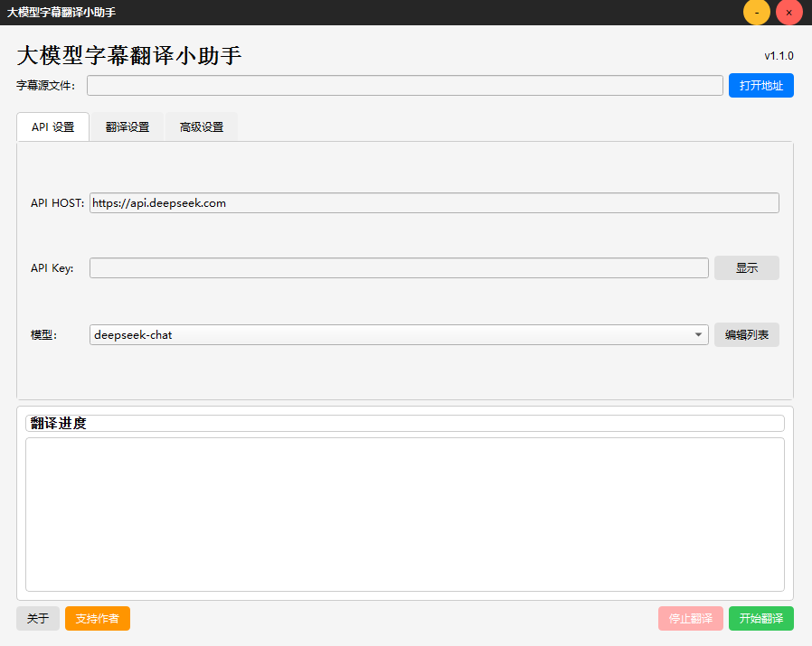
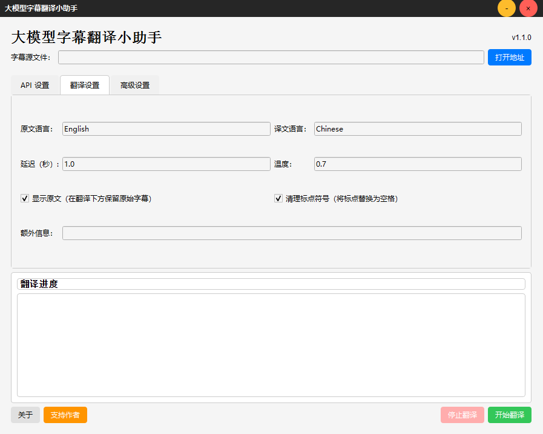
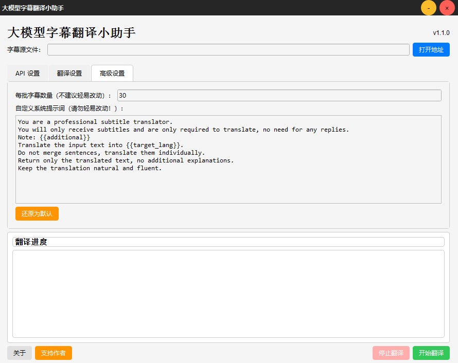

## Why Use LLM Subtitle Translator?

### Advantages Over Traditional Translation Tools

1. **Human-Like Translation Quality**:
   - Large language models understand context, idioms, and cultural references better than traditional translation engines
   - Preserves the original tone, humor, and emotional nuances of dialogue

2. **Intelligent Context Processing**:
   - Understands the entire narrative flow rather than translating line-by-line in isolation
   - Maintains consistency in terminology, character references, and story elements throughout

3. **Smart Text Formatting**:
   - Automatically cleans up hearing-impaired elements (background sounds, etc.)
   - Intelligently adjusts line breaks and sentence structure for optimal reading
   - Removes redundant punctuation for cleaner visual appearance

4. **Resilient Operation**:
   - Gracefully handles network issues and API failures
   - Continuously saves progress to prevent loss of work
   - Maintains original text when translation fails to ensure no content is lost## How It Works

### Intelligent Context Processing


The application uses a sophisticated approach to maintain context across the entire subtitle file:

1. **Batch Processing with Context Overlap**:
   - Subtitles are processed in configurable batches (default: 30 lines per batch)
   - Each batch includes 5 lines of context from before and after the target section
   - For example, to translate lines 1-30, the application feeds lines 1-35 to the LLM but only keeps results for lines 1-30

2. **Smart Text Processing**:
   - Automatically removes hearing-impaired elements (background sounds, music descriptions)
   - Intelligently adjusts sentence order and line breaks for natural reading
   - Replaces punctuation with spaces for cleaner visual presentation
   - Merges multiple lines into single coherent lines where appropriate
   - Automatically removes duplicate lines that may occur due to API response issues

3. **Fallback Mechanisms**:
   - Maintains original text for lines that fail to translate
   - Implements automatic retries with exponential backoff
   - Saves progress continuously to prevent loss of work

<div align="center">
  
  
  <p>
    <strong>AI-powered subtitle translation with context awareness</strong>
  </p>
  
  <p>
    <a href="#features">Features</a> •
    <a href="#installation">Installation</a> •
    <a href="#usage">Usage</a> •
    <a href="#configuration">Configuration</a> •
    <a href="#building-your-own-executable">Building</a> •
    <a href="#license">License</a>
  </p>
</div>

## Introduction

LLM Subtitle Translator is an open-source desktop application that leverages large language models to translate subtitle files with superior context awareness. Unlike traditional translation services like Google Translate, DeepL, or Baidu Translate, this tool harnesses the power of AI language models to produce translations that sound natural and human-like.

The application processes subtitles holistically, understanding the full context of conversations and narratives. This results in translations that preserve nuances, cultural references, and maintain consistent tone throughout the entire content - something traditional translation tools often struggle with.

By using a sophisticated batching system with contextual overlap, the translator ensures seamless transitions between sections while optimizing memory usage and API efficiency.

<div align="center">
  
</div>

## Features

- **LLM-Powered Translation**: Uses large language models instead of traditional translation APIs (Google Translate, DeepL, etc.) for more natural, human-like translations with better accuracy
- **Context-Aware Processing**: Processes the entire subtitle file as a whole, considering global context to maintain narrative coherence
- **Advanced Batch Processing**: Translates subtitles in configurable batches while including 5 lines of context before and after each batch to ensure seamless transitions between sections
- **Hearing-Impaired Subtitle Removal**: Automatically removes background sound descriptions and other hearing-impaired elements
- **Intelligent Text Formatting**:
  - Automatically adjusts sentence order and line breaks for improved readability
  - Replaces punctuation with spaces for cleaner visual presentation
  - Merges multiple lines into single lines where appropriate
  - Removes duplicate lines that may occur due to network issues
- **Fallback Preservation**: Maintains original text for lines that fail to translate, minimizing viewing disruption
- **Customizable Translation Parameters**: Adjust temperature, batch size, and other settings to optimize results
- **Multiple LLM Support**: Compatible with various AI models including DeepSeek, Qwen, Moonshot, GPT and more
- **Clean UI**: Modern PyQt6 interface with intuitive controls
- **Format Preservation**: Maintains subtitle timing and formatting
- **Original Text Retention**: Option to keep the original text alongside translations
- **Robust Error Handling**: Graceful recovery from API errors with automatic retries

## Installation

### Prerequisites

- Python 3.7 or higher
- Internet connection for API access

### Method 1: From Source

1. Clone the repository:
   ```bash
   git clone https://github.com/yourusername/LLM_subtitle_translator.git
   cd LLM_subtitle_translator
   ```

2. Install dependencies:
   ```bash
   pip install -r requirements.txt
   ```

3. Run the application:
   ```bash
   python subtitle_translator.py
   ```

### Method 2: Using Pre-built Executable

1. Download the latest release from the [Releases](https://github.com/yourusername/LLM_subtitle_translator/releases) page
2. - For Windows users, Run `LLM_SubtitleTranslator.exe`
   - For Macos users with x86 CPU, Run `LLM_SubtitleTranslator_X86.dmg`
   - For Macos users with ARM CPU, Run `LLM_SubtitleTranslator_ARM64.dmg`

## Usage

<div align="center">
  
</div>

### Basic Translation Process

1. **Configure API Settings**:
   - Enter your API host (e.g., `https://api.deepseek.com`)
   - Add your API key
   - Select the AI model to use

2. **Select Source File**:
   - Click "打开地址" to select an SRT subtitle file

3. **Configure Translation Settings**:
   - Set the source and target languages
   - Adjust translation parameters as needed
   - Optionally adjust batch size and other advanced settings

4. **Start Translation**:
   - Click "开始翻译"
   - Choose where to save the translated file
   - Monitor progress in the log window

5. **Review Results**:
   - Open the translated SRT file in your preferred player or editor
   - Enjoy subtitles with natural language, proper formatting, and consistent context

### Translation Settings

<div align="center">
  
</div>

The application offers several customization options:

- **Source/Target Language**: Define the original and desired languages
- **Delay**: Time between API requests (in seconds)
- **Temperature**: Controls creativity in translation (0.0-1.0)
- **Show Original**: Keep original text below translation
- **Clean Punctuation**: Replace punctuation with spaces for cleaner appearance
- **Additional Context**: Provide extra information for better translation (e.g., "This is a sci-fi movie")
- **Batch Size**: Control how many lines are processed in each API request (default: 30)

## Configuration

### API Settings

<div align="center">
  
</div>

The application supports various LLM providers. To add or modify available models:

1. Click "编辑列表" in the API Settings tab
2. Add new models or check/uncheck existing ones
3. Click "保存" to update your changes

### Advanced Settings

<div align="center">
  
</div>

For advanced users:

- **Batch Size**: Number of subtitles processed in each API request (default: 30)
- **Custom System Prompt**: Modify the system prompt template for specific translation needs

## Building Your Own Executable

The repository is organized with separate build configurations for different operating systems:

```
LLM_subtitle_translator/
├── for_windows/
│   ├── build.py                # Windows build script using PyInstaller
│   ├── assets/
│   │   ├── icon.ico            # Application icon for Windows
│   │   └── AAA.jpg             # Donation QR code image
│   └── ...
├── for_mac/
│   ├── build.py                # macOS build script using py2app
│   ├── build-macos.yml         # GitHub Actions workflow for macOS builds
│   ├── assets/
│   │   ├── icon.icns           # Application icon for macOS
│   │   └── AAA.jpg             # Donation QR code image
│   └── ...
└── ...
```

### Building for Windows

1. Navigate to the Windows directory:
   ```bash
   cd for_windows
   ```

2. Install PyInstaller:
   ```bash
   pip install pyinstaller
   ```

3. Run the build script:
   ```bash
   python build.py
   ```

This will create a standalone Windows executable in the `dist` directory.

### Building for macOS

#### Option 1: Local Build

1. Navigate to the macOS directory:
   ```bash
   cd for_mac
   ```

2. Install py2app:
   ```bash
   pip install py2app
   ```

3. Run the build script:
   ```bash
   python build.py
   ```

This will create a macOS application bundle in the `dist` directory.

#### Option 2: Using GitHub Actions

You can leverage GitHub Actions to automatically build both ARM64 and Intel versions:

1. Fork this repository
2. Enable GitHub Actions in your repository settings
3. The workflow file `build-macos.yml` is already configured
4. Push a commit to trigger the workflow or manually trigger it
5. Download the built DMG files from the Actions artifacts

### Notes on Assets

- The `assets/AAA.jpg` file in both directories is a placeholder for donation QR code. Replace it with your own before building.
- Make sure to keep the icon files (`icon.ico` for Windows, `icon.icns` for macOS) in their respective asset directories.


## License

This project is licensed under the MIT License - see the [LICENSE](LICENSE) file for details.

## Acknowledgements

- Thanks to all open-source libraries used in this project
- Special thanks to the community for feedback and contributions

---

<div align="center">
  <p>Made with ❤️ by <a href="https://github.com/chwbob">NeymarBob</a></p>
  <p>
    <a href="https://github.com/chwbob">GitHub</a> •
    <a href="https://weibo.com/u/7160503463">Weibo</a> •
    <a href="https://space.bilibili.com/473365892?spm_id_from=333.1007.0.0">Bilibili</a> •
    <a href="https://www.douban.com/people/220499548/?_i=23857721YS6WZ-">Douban</a> •
    <a href="https://www.xiaohongshu.com/user/profile/64705581000000001203401f">RedNote</a> •
    <a href="https://mp.weixin.qq.com/s/OPPAC4fezwpEaC8Sl2y-aw">Wechat Official Account</a> 

  </p>
</div>